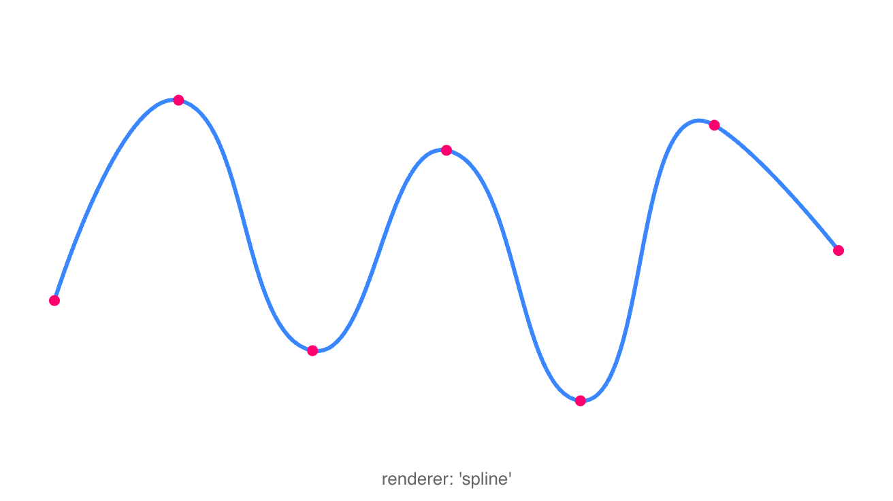
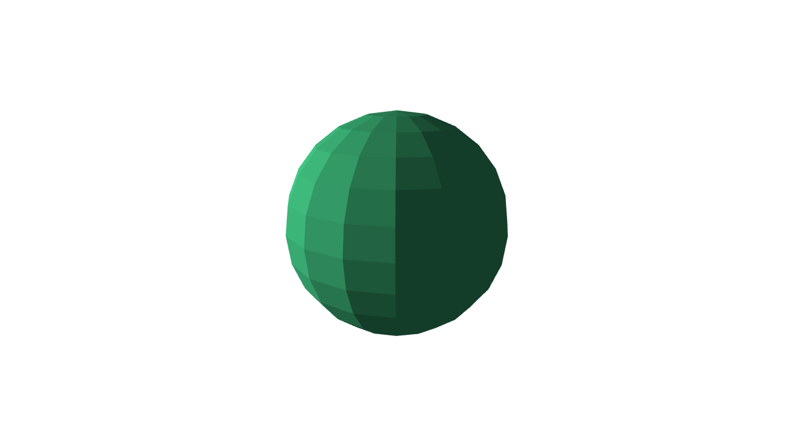
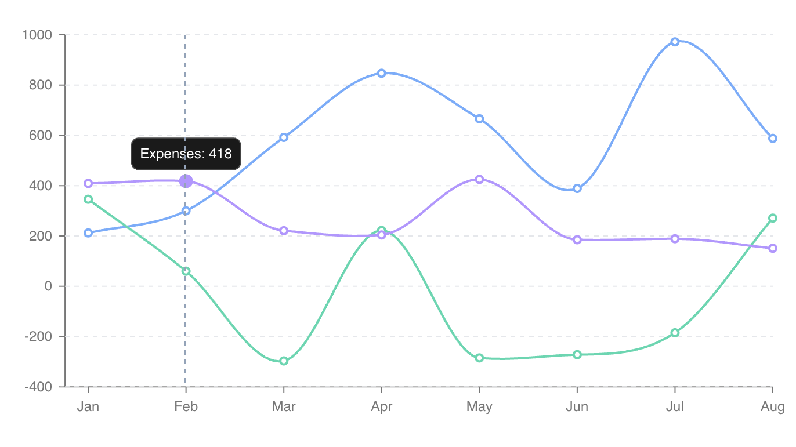
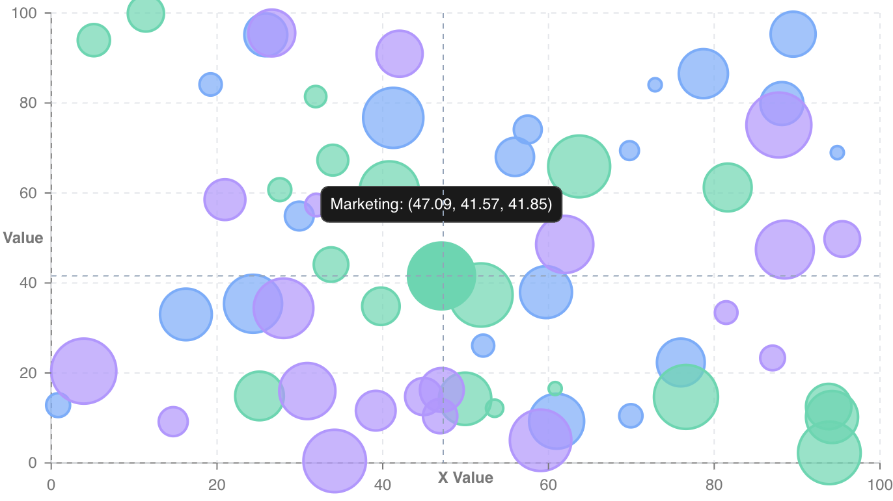
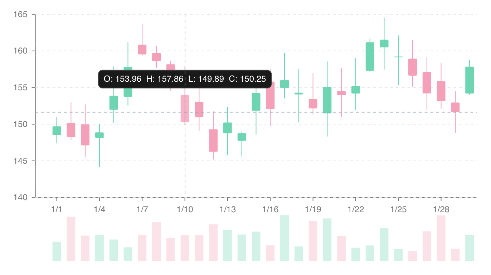
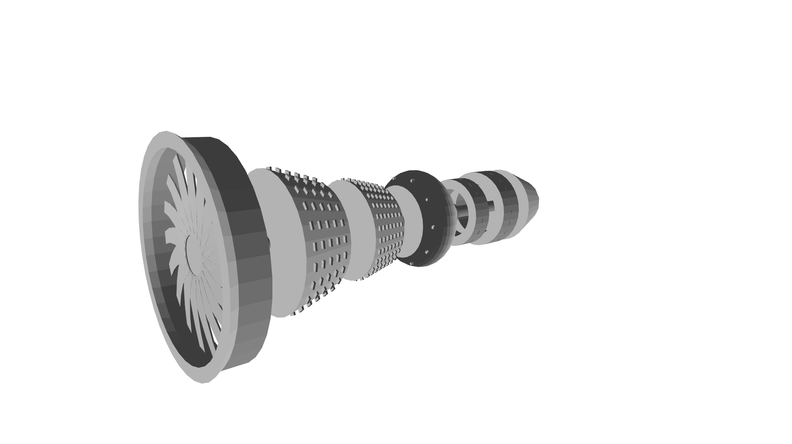

<div align="center">
  
</div>

<h1 align="center">Ripl</h1>

Ripl (pronounced "ripple") is a library that provides a **unified API for 2D graphics rendering** (Canvas & SVG) in the browser, with a focus on high performance and interactive data visualization. It also includes a 3D rendering package.

Working with the canvas API can be notoriously difficult as it is designed to be very low-level. Alternatively, working with SVG is rather straightforward but not without its flaws. Because these paradigms differ widely in their implementations developers often have to choose one or the other at the outset of a project. Ripl alleviates the issue by exposing a unified API and mimicking the DOM/CSSOM in as many ways as possible to make it simple for developers to interact with. Switching between Canvas and SVG is as simple as changing one line of code.

<div align="center">
  <table>
    <tr>
      <td align="center"><b>Spline Polyline</b><br></td>
      <td align="center"><b>3D Sphere</b><br></td>
      <td align="center"><b>Multi-Line Graph</b><br></td>
    </tr>
    <tr></tr>
    <tr>
      <td align="center"><b>Bubble Scatter</b><br></td>
      <td align="center"><b>Candlestick Chart</b><br></td>
      <td align="center"><b>Jet Engine Model</b><br></td>
    </tr>
  </table>
</div>

## Features

- **Unified rendering API** across Canvas, SVG, Terminal (braille/ANSI), and WebGPU 3D contexts, so the same scene renders anywhere
- **Grouping and property inheritance**: visual properties cascade through the element tree, much like CSS
- **Scene and renderer management** with a hoisted scenegraph, O(n) rendering, and an automatic `requestAnimationFrame` loop
- **DOM-like event system** supporting event bubbling, delegation, stop propagation, and disposable subscriptions
- **Interactive navigator** for pan, zoom, and brush gestures on any context, the flat-scene analogue of the 3D camera
- **CSS-like element querying**: `getElementById`, `getElementsByType`, `getElementsByClass`, plus `query`/`queryAll` with selector syntax
- **Bounding box detection** via `getBoundingBox` on all shape elements
- **Context exporting**: snapshot any context to an image (`ImageData`), an object URL, or a string (PNG data URL / SVG markup / terminal text)
- **Transforms** (translate, scale, rotation, and transform-origin) on every element
- **Clipping**: path-based clipping via `Shape2D`
- **Shadows, filters, and blend modes** applied per element
- **Gradient support**: CSS gradient parsing and serialization (linear, radial, conic)
- **Pattern fill support** for repeating `pattern(...)` paint strings (diagonal, cross-hatch, dots, horizontal, vertical) in fills and strokes
- **Automatic interpolation** for numbers, colors (RGB, hex, HSL), dates, gradients, patterns, paths, strings, and rotation values
- **High performance animation**: cancelable `Task`-based transitions with CSS-like keyframe support and custom interpolators
- **14 scale types** inspired by D3 (continuous, discrete, ordinal, band, point, diverging, logarithmic, symmetric-log, power, radial, quantile, quantize, threshold, time), plus `scaleLog`/`scaleSqrt` shortcuts
- **25 pre-built chart types** via `@ripl/charts`
- **Built-in shape primitives**: arc, circle, rect, line, polyline, polygon, ellipse, text, path, image
- **3D primitives**: cube, sphere, cylinder, cone, plane, torus
- **Easing library** covering linear, quad, cubic, quart, quint, sine, exponential, circular, back, elastic, and bounce (in/out/inOut variants)
- **Color utilities** for parsing, serialization, and color scales
- **Math & geometry** helpers: degree/radian conversion, point operations, border radius normalization, polygon extrapolation
- **Renderer debug overlay** with an FPS counter, element count, and bounding box visualization
- **Runtime devtools** bridge (`@ripl/devtools`) with a companion browser extension for live scene-graph inspection and editing
- **Completely modular and tree-shakable**, so you only ship the features you use
- **Strictly typed** in TypeScript
- **Zero runtime dependencies**

## Packages

| Package | Description |
|---------|-------------|
| [`@ripl/web`](packages/web) | **Main entry point for browser usage**. Re-exports core + canvas context with browser platform bindings |
| [`@ripl/core`](packages/core) | Core rendering: elements, scene, renderer, animation, scales, math, color, interpolation, gradients, tasks |
| [`@ripl/canvas`](packages/canvas) | Canvas 2D rendering context |
| [`@ripl/svg`](packages/svg) | SVG rendering context |
| [`@ripl/charts`](packages/charts) | Pre-built chart components with axes, legends, tooltips, crosshairs, and grids |
| [`@ripl/3d`](packages/3d) | 3D rendering context with camera, shading, and primitive shapes |
| [`@ripl/webgpu`](packages/webgpu) | WebGPU-accelerated 3D rendering context with hardware depth testing and WGSL shaders |
| [`@ripl/terminal`](packages/terminal) | Terminal rendering context with braille-character output and ANSI truecolor |
| [`@ripl/node`](packages/node) | Node.js runtime bindings that configure the platform factory for headless environments |
| [`@ripl/devtools`](packages/devtools) | Page-side devtools bridge that streams the scene graph to the browser extension for live inspection |
| [`@ripl/dom`](packages/dom) | DOM utilities used internally by browser contexts |
| [`@ripl/utilities`](packages/utilities) | Shared typed utility functions: type guards, collection helpers, DOM helpers |

The project is structured as a Yarn 4 monorepo:

```
packages/
├── core/         # Core rendering library
├── canvas/       # Canvas 2D rendering context
├── svg/          # SVG context implementation
├── charts/       # Pre-built chart components
├── 3d/           # 3D rendering
├── webgpu/       # WebGPU 3D rendering context
├── terminal/     # Terminal rendering context
├── node/         # Node.js runtime bindings
├── web/          # Main browser entry point
├── devtools/     # Page-side devtools bridge
├── dom/          # DOM utilities
├── utilities/    # Shared typed utility functions
└── test-utils/   # Test utilities
apps/website/     # Documentation site (VitePress) with live demos
```

## Usage

The following is a tour of Ripl's features starting from the most basic and progressively building towards more advanced concepts.

### Render a Basic Element

```typescript
import {
    createCircle,
    createContext,
} from '@ripl/web';

// Create a canvas context bound to a DOM element
const context = createContext('.mount-element');

// Create an element
const circle = createCircle({
    fill: 'rgb(30, 105, 120)',
    lineWidth: 4,
    cx: context.width / 2,
    cy: context.height / 2,
    radius: context.width / 3,
});

// Render the element to the context
circle.render(context);
```

Built-in 2D shape primitives: `arc`, `circle`, `rect`, `line`, `polyline`, `polygon`, `ellipse`, `text`, `path`, `image`.

### Modify Element Properties

To modify an element simply change any of its properties and re-render it.

```typescript
circle.fill = '#FF0000';
circle.cx = context.width / 3;
circle.cy = context.height / 3;
circle.render(context);
```

### Switch Contexts (Canvas / SVG)

To render the same element to SVG, replace the `createContext` import from `@ripl/web` with `@ripl/svg`:

```typescript
import {
    createContext,
} from '@ripl/svg';

import {
    createCircle,
} from '@ripl/web';

const context = createContext('.mount-element');
const circle = createCircle({ /* same options */ });
circle.render(context);
```

### Grouping and Inheritance

Render multiple elements in groups with inherited properties (like CSS) and event bubbling (like the DOM):

```typescript
import {
    createCircle,
    createContext,
    createGroup,
    createRect,
} from '@ripl/web';

const context = createContext('.mount-element');

const circle = createCircle({
    cx: context.width / 2,
    cy: context.height / 2,
    radius: context.width / 3,
});

const rect = createRect({
    x: context.width / 2,
    y: context.height / 2,
    width: context.width / 5,
    height: context.height / 5,
});

// Both children inherit fill and lineWidth from the group
const group = createGroup({
    fill: 'rgb(30, 105, 120)',
    lineWidth: 4,
    children: [circle, rect],
});

group.render(context);
```

### Querying Elements

Elements can be queried using common DOM methods or CSS-like selectors:

```typescript
const circles = parentGroup.getElementsByType('circle');
const shapes = parentGroup.queryAll('.shape');
const first = parentGroup.query('#child-group > .shape');
```

Supported selector features:

```css
circle                                   /* type */
#element-id                              /* id */
.element-class                           /* class */
circle[radius="5"]                       /* attribute */
.group-class circle                      /* descendant */
.group-class > circle                    /* direct child */
.group-class rect + circle.circle-class  /* adjacent sibling */
```

### Scene and Renderer

A `Scene` is the top-level group bound to a rendering context. A `Renderer` drives the animation loop via `requestAnimationFrame`.

```typescript
import {
    createCircle,
    createGroup,
    createRect,
    createRenderer,
    createScene,
} from '@ripl/web';

const circle = createCircle({
    fill: 'rgb(30, 105, 120)',
    cx: 100,
    cy: 100,
    radius: 40,
});

const rect = createRect({
    fill: 'rgb(30, 105, 120)',
    x: 200,
    y: 80,
    width: 60,
    height: 60,
});

// Scene takes a target (selector, element, or context) and options
const scene = createScene('.mount-element', {
    children: [circle, rect],
});

const renderer = createRenderer(scene, {
    autoStart: true,
    autoStop: true,
});

// Listen for events
circle.on('click', event => console.log(event));
```

### Animation

The renderer provides transition-based animation. Transitions are cancelable `Task` instances (extending `Promise` with `AbortController` integration).

```typescript
import {
    easeOutCubic,
} from '@ripl/web';

// Animate a single element
await renderer.transition(circle, {
    duration: 1000,
    ease: easeOutCubic,
    state: {
        fill: '#FF0000',
        cx: 200,
        cy: 200,
        radius: 60,
    },
});

// Animate multiple elements (or a whole group/scene)
await renderer.transition([circle, rect], {
    duration: 1000,
    ease: easeOutCubic,
    state: {
        fill: '#FF0000',
    },
});
```

#### Keyframes

```typescript
// Implicit keyframe offsets
await renderer.transition(circle, {
    duration: 1000,
    ease: easeOutCubic,
    state: {
        fill: [
            '#FF0000', // offset ~0.33
            '#00FF00', // offset ~0.66
            '#0000FF', // offset 1
        ],
    },
});

// Explicit keyframe offsets
await renderer.transition(circle, {
    duration: 1000,
    ease: easeOutCubic,
    state: {
        fill: [
            {
                value: '#FF0000',
                offset: 0.25,
            },
            {
                value: '#0000FF',
                offset: 0.8,
            },
        ],
    },
});

// Custom interpolator function
await renderer.transition(circle, {
    duration: 1000,
    ease: easeOutCubic,
    state: {
        radius: t => t * 100, // 0 <= t <= 1
    },
});
```

### Transforms

Every element supports CSS-like transforms:

```typescript
const rect = createRect({
    x: 100,
    y: 100,
    width: 80,
    height: 80,
    rotation: '45deg', // or radians as a number
    transformOriginX: '50%', // or pixels as a number
    transformOriginY: '50%',
    translateX: 20,
    translateY: 10,
    transformScaleX: 1.5,
    transformScaleY: 1.5,
});
```

Transforms can also be animated via `renderer.transition`.

## Exporting

Every context can capture a snapshot of what it has rendered and export it to an image, URL, or string via `export()`:

```typescript
const snapshot = context.export();

const str = snapshot.toString(); // PNG data URL (SVG → markup, Terminal → braille text)
const url = snapshot.toURL(); // openable Blob object URL
const image = await snapshot.toImage(); // low-level ImageData (environment-agnostic)
```

The exact outputs depend on the context: Canvas, 3D, and WebGPU export raster images; SVG exports vector markup (and can rasterize to an image); Terminal exports braille text (and a rasterized image). Charts forward `export()` to their underlying context:

```typescript
const chart = createBarChart('.mount-element', options);

// e.g. open the rendered chart in a new tab
window.open(chart.export().toURL(), '_blank');
```

## Charts

`@ripl/charts` provides 25 ready-to-use, animated chart types. Each chart supports tooltips, legends, crosshairs, grids, axes, and data update animations out of the box.

| Chart | Factory |
|-------|---------|
| Arc Diagram | `createArcDiagramChart` |
| Area | `createAreaChart` |
| Bar | `createBarChart` |
| Box Plot | `createBoxPlotChart` |
| Chord | `createChordChart` |
| Force-Directed | `createForceDirectedChart` |
| Funnel | `createFunnelChart` |
| Gantt | `createGanttChart` |
| Gauge | `createGaugeChart` |
| Heatmap | `createHeatmapChart` |
| Histogram | `createHistogramChart` |
| Line | `createLineChart` |
| Packed Circle | `createPackedCircleChart` |
| Pie / Donut | `createPieChart` |
| Polar Area | `createPolarAreaChart` |
| Polar Scatter | `createPolarScatterChart` |
| Radar | `createRadarChart` |
| Radial Bar | `createRadialBarChart` |
| Realtime | `createRealtimeChart` |
| Sankey | `createSankeyChart` |
| Scatter | `createScatterChart` |
| Stock (OHLC) | `createStockChart` |
| Sunburst | `createSunburstChart` |
| Treemap | `createTreemapChart` |
| Trend (Bar + Line) | `createTrendChart` |

Charts are constructed by passing a target element and an options object:

```typescript
import {
    createBarChart,
} from '@ripl/charts';

const chart = createBarChart('.mount-element', {
    data: [
        {
            category: 'A',
            value: 30,
        },
        {
            category: 'B',
            value: 70,
        },
        {
            category: 'C',
            value: 45,
        },
    ],
    key: 'category',
    series: [
        {
            id: 'values',
            label: 'Values',
            value: 'value',
        },
    ],
});

// Update with new data
chart.update({
    data: [
        {
            category: 'A',
            value: 50,
        },
        {
            category: 'B',
            value: 20,
        },
        {
            category: 'C',
            value: 80,
        },
    ],
});
```

Reusable chart components: `ChartXAxis`, `ChartYAxis`, `Grid`, `Legend`, `ColorLegend`, `Tooltip`, `Crosshair`, and `ChartAnnotations` (reference lines, bands, and point markers).

## Scales

Ripl provides 14 scale types for mapping data between domains and ranges, inspired by [D3](https://d3js.org/d3-scale). Scales expose `inverse`, `ticks`, and `includes` methods (the categorical `scaleOrdinal` maps value → value and exposes just its `domain` and `range`).

```typescript
import {
    scaleBand,
    scaleContinuous,
    scaleDiscrete,
    scaleDiverging,
    scaleLogarithmic,
    scaleOrdinal,
    scalePoint,
    scalePower,
    scaleQuantile,
    scaleQuantize,
    scaleRadial,
    scaleSymlog,
    scaleThreshold,
    scaleTime,
} from '@ripl/web';
```

`scaleLog` and `scaleSqrt` are also exported as shortcuts for a base-10 logarithmic scale and a power scale with exponent 0.5.

### Continuous (Linear)

```typescript
const scale = scaleContinuous([0, 25], [-100, 100]);
scale(10); // -20
scale.inverse(-20); // 10

// With clamping
const clamped = scaleContinuous([0, 25], [-100, 100], { clamp: true });
clamped(30); // 100
```

### Discrete

```typescript
const scale = scaleDiscrete(['a', 'b', 'c'], [0, 50]);
scale('b'); // 25
```

### Band

```typescript
const scale = scaleBand(['A', 'B', 'C'], [0, 300], {
    innerPadding: 0.1,
    outerPadding: 0.05,
});
scale('B'); // position of band B
scale.bandwidth; // width of each band
```

### Additional Scales

- **`scaleDiverging`** maps values below and above a midpoint to separate sub-ranges
- **`scaleLogarithmic`** is a logarithmic mapping with configurable base (`scaleLog` is the base-10 shortcut)
- **`scaleOrdinal`** maps discrete domain values to discrete range values, cycling the range
- **`scalePoint`** positions discrete values at evenly spaced points along a range
- **`scalePower`** is a polynomial mapping with configurable exponent (`scaleSqrt` is the exponent-0.5 shortcut)
- **`scaleQuantile`** maps continuous data to discrete quantile bins
- **`scaleQuantize`** maps a continuous domain to discrete range values
- **`scaleRadial`** maps a numeric magnitude onto a ring radius (clamped by default), for radial/polar charts
- **`scaleSymlog`** is a symmetric-log mapping that handles negatives and zero (linear near zero, log beyond a configurable `constant`)
- **`scaleThreshold`** maps values to discrete outputs based on threshold boundaries
- **`scaleTime`** maps `Date` domains to numeric ranges

## 3D Rendering

`@ripl/3d` extends the Canvas context with perspective/orthographic projection, camera controls, and flat shading.

```typescript
import {
    Camera,
    Context3D,
    createCube,
    createSphere,
} from '@ripl/3d';
```

Available 3D primitives: `cube`, `sphere`, `cylinder`, `cone`, `plane`, `torus`.

Camera supports interactive zoom, pivot, and pan with configurable sensitivity. For hardware-accelerated rendering, `@ripl/webgpu` provides a drop-in WebGPU context with a real depth buffer, MSAA, and WGSL shaders; the same `Shape3D` elements work in both.

## Performance

1. **Scene + Renderer.** Elements in a scene are hoisted into a flat buffer, converting render traversal from O(n^c) to O(n). The cost shifts to adding/removing elements from groups.
2. **Persistent path keys.** Always pass a stable ID to `context.createPath(id)` so SVG contexts can efficiently diff DOM elements between frames.
3. **Memory lifecycle.** Call `destroy()` on elements, scenes, and renderers when done to clean up subscriptions and DOM references.
4. **Auto-stop.** The renderer stops ticking when idle (no active transitions and the mouse has left the canvas) to avoid unnecessary CPU usage.
5. **Debug overlay.** Enable `{ debug: true }` on the renderer to visualize FPS, element count, and bounding boxes during development.

## Development

```bash
# Install dependencies
yarn install

# Build all packages
yarn build

# Run tests
yarn test

# Lint
yarn lint
```

## License

[MIT](LICENSE)
